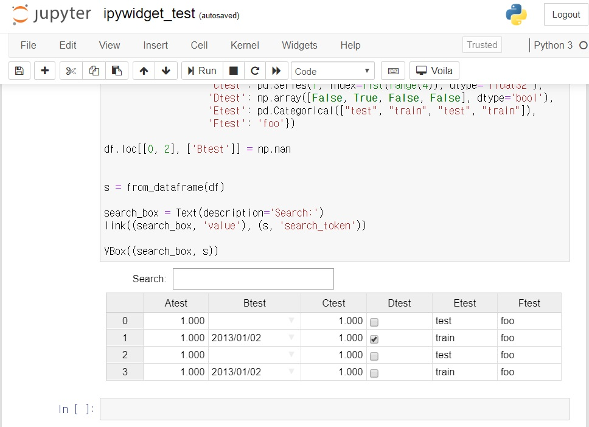

# **Jupyter**

---


# Jupyter?

- Visual programming in webbrowser  
(python, R, julia ...)  


---

# Jupyter?

- **IPython**에서 다중 kernel(language)을 지원하기 위해 확장됨
- Webbrowser 상에서 *.ipynb 파일을 열고 코드를 실행할 수 있는 shell 제공
- 한 페이지에서 코딩, 결과 확인이 실시간으로 가능
- 하나의 *.ipynb 파일에 python뿐만 아니라 markdown 문법으로 작성된 설명, 시각화된 그래프 등을 넣을 수 있음
- excel을 대체할 수 있는 데이터 분석 툴로 주목받고 있음
- 참고: https://jupyter.org/

---

> #### IPython?
> - Python용으로 개발 된 대화형 shell
> - Python에서 지원하는 기능 외에 최적화, 디버깅, 코드 편집, 탐색 등에 있어 편리한 기능을 포함
>   - 실시간으로 object내 data 확인
>   - system shell에 바로 접근해 system상의 command 실행 가능
>   - 현재 session 동안 기존에 실행했던 command history 제공
>   - ipython 자체만의 command 제공 등
> - IPython notebook이라는 webbrowser로 확장된 기능을 제공하면서 시각화된 data를 표현할 수 있게됨

---

# Jupyter 설치

- Python 설치
https://www.python.org/downloads/
(python 3.4버전 이후에는 pip가 기본으로 포함되어 있음)
<br>

- Jupyter 설치
```
pip install jupyterlab
```

---

# Jupyter 실행

<br>

```
jupyter notebook
```
or
```
jupyter lab
```

---

# Jupyter Notebook 실행화면

**Main 화면**  


---

# Jupyter Notebook 실행화면

***.ipynb**


---

# Sample code(ipysheet)

```python
from ipysheet import sheet, cell, row, column, cell_range

sheet1 = sheet(rows=3, columns=4)
cell1 = cell(0, 0, "Hi")
cell2 = cell(2, 0, "end")
cell_value = cell(2, 2, 42.)
sheet1
```


---
# Demo
- http://localhost:8888/notebooks/test/

---

ipython 설명
jupyter 조작화면  
jupyter 설명  
excel 장단점  
jupyter가 excel을 대체할 수 있는 가능성, with json  
jupyter 장단점  
fbp_designer에서 사용중인 javascript library 사용 예시  
jupyter demo  